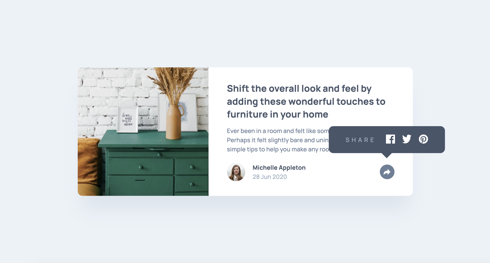

# Article preview component solution

This is a solution to the [Article preview component challenge on Frontend Mentor](https://www.frontendmentor.io/challenges/article-preview-component-dYBN_pYFT).

## Table of contents

- [Overview](#overview)
  - [The challenge](#the-challenge)
  - [Screenshot](#screenshot)
  - [Links](#links)
- [My process](#my-process)
  - [Built with](#built-with)
  - [What I learned](#what-i-learned)
  - [Continued development](#continued-development)
  - [Useful resources](#useful-resources)
- [Author](#author)

## Overview

### The challenge

Users should be able to:

- View the optimal layout for the component depending on their device's screen size
- See the social media share links when they click the share icon

### Screenshot



### Links

- [Solution on frontendmentor.io](https://www.frontendmentor.io/solutions/article-preview-component-pure-css-hfaLmJNVcu)
- [Live preview](https://piwkoo.github.io/article-preview-component/)

## My process

### Built with

- Semantic HTML5 markup
- CSS custom properties
- Flexbox
- Mobile-first workflow
- BEM methodology

### What I learned

This challenge was interesting. I was able to play with different CSS and HTML tricks. There is a (let's say) recommendation for share button to work using JavaScript, but I thought it's not necessary so in this project you will see solution with pure CSS. I know these kind of tricks are useful in real life projects as well so, give it a look if you are as curious as I am.

```css
.css-triangle {
  border-top: 12px solid var(--main-color);
  border-left: 12px solid transparent;
  border-right: 12px solid transparent;
}
```

### Continued development

In future projects I want to test more of different approaches without using JavaScript. Sometimes it is just a fun fact to know, but sometimes it brings unconventional solutions which are helpful so why not.

### Useful resources

- [CSS Triangle](https://css-tricks.com/snippets/css/css-triangle/) - If you haven't had a chance to create triangle using CSS I recommend you to check out this article. It should give a better understanding on how and why it works.

## Author

- Github - [@PiwkoO](https://github.com/PiwkoO)
- Frontend Mentor - [@PiwkoO](https://www.frontendmentor.io/profile/PiwkoO)
